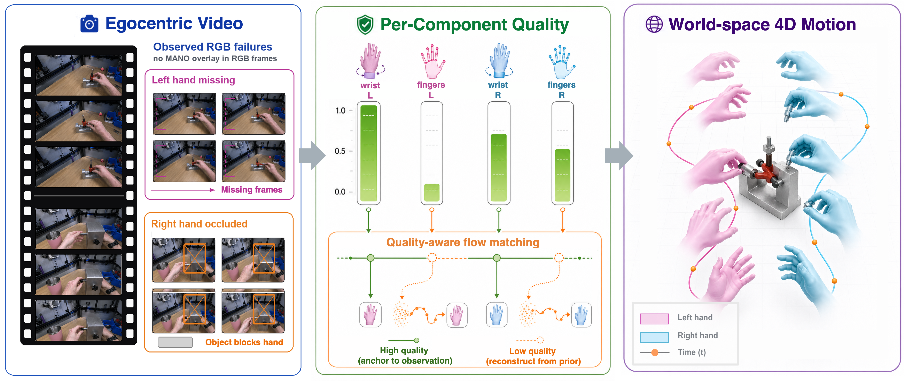

  <h1 align="center"><strong>StableHand: Quality-Aware Flow Matching for World-Space Dual-Hand Motion Estimation from Egocentric Video</strong></h1>
  

    <a href="https://huajian-zeng.github.io/">Huajian Zeng</a>1, Chaohua Yao2, <a href="https://scholar.google.com/citations?user=Lh2CthAAAAAJ&hl">Yuantai Zhang</a>1, <a href="https://scholar.google.com/citations?hl=zh-CN&user=f7ox7CIAAAAJ">Jiaqi Yang</a>1, <a href="https://rolpotamias.github.io/">Rolandos Alexandros Potamias</a>3, <a href="https://xingxingzuo.github.io/">Xingxing Zuo</a>1,*
     
    1Mohamed Bin Zayed University of Artificial Intelligence (MBZUAI)
     
    2University of Illinois at Urbana-Champaign (UIUC)
     
    3Imperial College London
     
    *Corresponding author
     
  

  
<strong>In Submission</strong>

## 🔥 Highlight 

**StableHand** is a quality-aware flow-matching framework that recovers world-space 4D motion of two interacting hands from egocentric video, even under long missing-hand spans and persistent hand–object occlusions.

We decompose noisy hand observations into four quality channels (wrist global translation and finger articulations of both hands), predicted by a learned quality network. These signals drive a per-channel forward schedule, a quality-adjusted velocity target, AdaLN modulation of a DiT denoiser, and a quality-aware ODE initialization, so that reliable observations are anchored while unreliable ones are regenerated from a learned bimanual motion prior.

On HOT3D and ARCTIC, StableHand achieves state-of-the-art performance across all reported metrics, **reducing W-MPJPE by 20–25%** over the strongest baseline, with the largest gains on heavily occluded ARCTIC sequences.

    

## 📢 The code will be released after the paper is accepted. Stay tuned!
