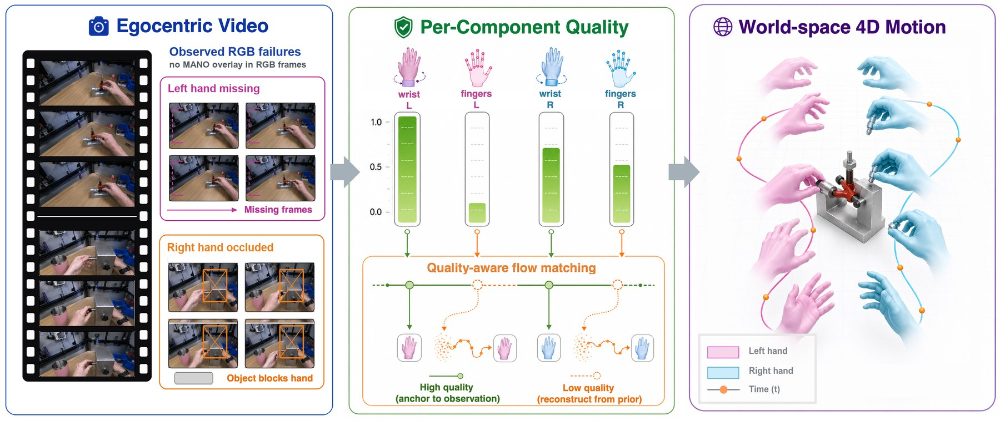

<p align="center">
  <h1 align="center"><strong>StableHand: Quality-Aware Flow Matching for World-Space Dual-Hand Motion Estimation from Egocentric Video</strong></h1>
  <p align="center">
    <a href="https://huajian-zeng.github.io/">Huajian Zeng</a><sup>1</sup>, Chaohua Yao<sup>2</sup>, <a href="https://scholar.google.com/citations?user=Lh2CthAAAAAJ&hl">Yuantai Zhang</a><sup>1</sup>, <a href="https://scholar.google.com/citations?hl=zh-CN&user=f7ox7CIAAAAJ">Jiaqi Yang</a><sup>1</sup>, <a href="https://rolpotamias.github.io/">Rolandos Alexandros Potamias</a><sup>3</sup>, <a href="https://xingxingzuo.github.io/">Xingxing Zuo</a><sup>1&dagger;</sup>
    <br>
    <sup>1</sup>Mohamed bin Zayed University of Artificial Intelligence (MBZUAI), <sup>2</sup>University of Illinois at Urbana-Champaign (UIUC), <sup>3</sup>Imperial College London
    <br>
    <sup>&dagger;</sup>Corresponding author
    <br>
  </p>
</p>

<div id="top" align="center">

[](https://arxiv.org/abs/2605.18553)
[](https://huajian-zeng.github.io/projects/stablehand/)
[](https://youtu.be/2UmaYTKQOAM)
[](https://huggingface.co/huajian-zeng/stablehand)
[](https://huggingface.co/datasets/huajian-zeng/stablehand-data)

</div>

## Updates

[2026-05-18] Paper uploaded to [arXiv](https://arxiv.org/abs/2605.18553).

[2026-09-07] We released an [enhanced version of StableHand](docs/enhanced_version.md). Code, pretrained models, and HOT3D/ARCTIC data for demos and full evaluation are now available.

<p align="center">
  
</p>

## 🔥 Highlight

StableHand is a quality-aware flow-matching framework that recovers world-space 4D motion of two interacting hands from egocentric video, even under long missing-hand spans and persistent hand–object occlusions.

We decompose noisy hand observations into four quality channels (wrist global translation and finger articulations of both hands), predicted by a learned quality network. These signals drive a per-channel forward schedule, a quality-adjusted velocity target, AdaLN modulation of a DiT denoiser, and a quality-aware ODE initialization, so that reliable observations are anchored while unreliable ones are regenerated from a learned bimanual motion prior.

On HOT3D and ARCTIC, StableHand achieves state-of-the-art performance across all reported metrics, reducing W-MPJPE by 20–25% over the strongest baseline, with the largest gains on heavily occluded ARCTIC sequences.

https://github.com/user-attachments/assets/4ed90b51-4d77-4eb5-b3ee-b0dd6470cef4

## Installation

Tested on Linux with Python 3.10, PyTorch 2.5.1, and CUDA 12.4.

```bash
conda create -n stablehand python=3.10 -y
conda activate stablehand
pip install torch==2.5.1 --index-url https://download.pytorch.org/whl/cu124
pip install -r requirements.txt
pip install -c requirements-lock.txt --no-build-isolation "chumpy @ git+https://github.com/mattloper/chumpy@580566eafc9ac68b2614b64d6f7aaa84eebb70da"
```

For other CUDA versions, use the matching [PyTorch installation command](https://pytorch.org/get-started/locally/).

## Download Checkpoints and Data

If access is restricted, authenticate with an authorized Hugging Face account:

```bash
hf auth login
bash scripts/download_pretrained.sh
bash scripts/download_data.sh
```

- [Checkpoints](https://huggingface.co/huajian-zeng/stablehand): two motion priors and a shared Quality Network (~580 MB).
- [Data](https://huggingface.co/datasets/huajian-zeng/stablehand-data): caches for 244 HOT3D and 155 ARCTIC clips, with videos for six HOT3D and four ARCTIC demos (~835 MB).
- [MANO models](https://mano.is.tue.mpg.de/) (registration required): place `MANO_LEFT.pkl` and `MANO_RIGHT.pkl` in `data_loaders/mano_models/`.

### Released checkpoints

| Checkpoint | File |
|---|---|
| DiT motion prior for HOT3D | `save/dit_hot3d/model.pt` |
| DiT motion prior for ARCTIC | `save/dit_arctic/model.pt` |
| Quality Network | `save/qn/model.pt` |

## Quick Start

```bash
bash demo.sh
```

Runs HOT3D `clip-002736` and saves metrics, a comparison video, and a
[Rerun](https://rerun.io) recording to `outputs/demo/`.

```bash
rerun outputs/demo/clip-002736.rrd
CLIP=clip-002026 bash demo.sh  # try another example
```

## Inference

Run HOT3D inference with explicit arguments. Keep the benchmark-specific
calibration values shown here and below when using the released data.

```bash
python -m sample.infer_clips \
    --ckpt save/dit_hot3d/model.pt --qn_ckpt save/qn/model.pt \
    --qn_sigma_override 26.18328668456495,3.9939303136949373 \
    --depth_signal_dir data/hot3d/depth_signal \
    --clips clip-002736 --seed 42 --n_steps 20 \
    --out_dir outputs/benchmark
```

## ARCTIC

Run inference on the four ARCTIC examples with input videos:

```bash
python -m sample.infer_clips \
    --ckpt save/dit_arctic/model.pt --qn_ckpt save/qn/model.pt \
    --qn_sigma_override 29.102446586693446,11.377515771894934 \
    --rgb_dir data/arctic/rgb \
    --clips clip-300591,clip-300514,clip-300595,clip-300510 \
    --seed 42 --n_steps 20 --out_dir outputs/arctic
```

Render a world-space comparison video:

```bash
python -m visualize.render_world3d \
    --pred outputs/arctic/clip-300591.npz \
    --gt_dir data/arctic/clips_gt --rgb_dir data/arctic/rgb \
    --ckpt save/dit_arctic/model.pt \
    --out outputs/arctic/clip-300591_world3d.mp4
```

## Full evaluation

```bash
bash scripts/evaluate.sh hot3d  # 244 clips
bash scripts/evaluate.sh arctic # 155 clips
bash scripts/evaluate.sh all    # both benchmarks
```

Results are saved to `outputs/benchmark_hot3d244/` and
`outputs/benchmark_arctic155/`. Set `DEVICE=cuda:1` to select another GPU.

## TODO List

- [x] ~~Inference, evaluation, and visualization code~~
- [ ] Training code
- [ ] Data preprocessing code

## Citation

```bibtex
@article{zeng2026stablehand,
  title = {StableHand: Quality-Aware Flow Matching for World-Space Dual-Hand Motion Estimation from Egocentric Video},
  author = {Zeng, Huajian and Yao, Chaohua and Zhang, Yuantai and Yang, Jiaqi and Potamias, Rolandos Alexandros and Zuo, Xingxing},
  journal = {arXiv preprint arXiv:2605.18553},
  year = {2026},
}
```

## License and Acknowledgements

Research use only under [CC BY-NC 4.0](LICENSE). StableHand builds on
[WiLoR](https://github.com/rolpotamias/WiLoR),
[VGGT-Omega](https://github.com/facebookresearch/vggt-omega), and
[MANO](https://mano.is.tue.mpg.de/). Upstream components retain their respective licenses.
